# Menu: Tally Proses

&nbsp;&nbsp;&nbsp;&nbsp;&nbsp;**Tally Proses** adalah **Menu untuk pengolahan ikan dari awal sampai siap dikemas**.

---

## Daftar Isi

* [I. Alur Kerja Sistem](#i-alur-kerja-sistem)
* [II. Login dan Buat Sesi](#ii-login-dan-buat-sesi)
* [III. Registrasi Bahan Baku](#iii-registrasi-bahan-baku)
* [IV. Input Timbangan](#iv-input-timbangan)
* [V. Input Proses](#v-input-proses)
* [VI. Packing](#vi-packing)
    * [VI.I. Sebelum Glazing](#vi-i-sebelum-glazing)
    * [VI.II. Sesudah Glazing](#vi-ii-sesudah-glazing)
    * [VI.III. MCO Lama](#vi-iii-mco-lama)
* [VII. Tips & Trick](#vii-tips-&-trick)
* [VIII. Troubleshooting](#viii-troubleshooting)
* [IX. Cheklist Harian](#ix-checklist-harian)

---

## I. Alur Kerja Sistem

&nbsp;&nbsp;&nbsp;&nbsp;&nbsp;Berikut adalah diagram alur yang menggambarkan tahapan lengkap dari awal hingga akhir:

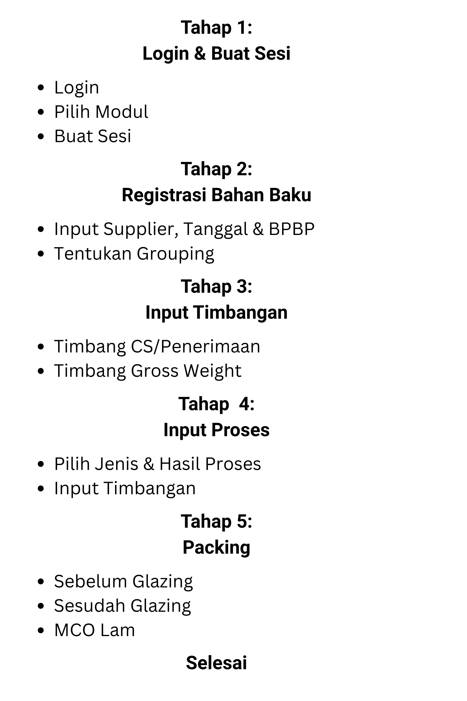
*Gambar I.I: Diagram Alur Kerja Sistem.* 
    
---

## II. Login dan Buat Sesi

&nbsp;&nbsp;&nbsp;&nbsp;&nbsp;Ikuti langkah-langka berikut:
1.  **Buka Aplikasi:** Buka aplikasi melalui browser (disarankan **Google Chrome**), lalu akses: [https://synergis.berkat-agung.com/tallyikan/product-index.php](https://synergis.berkat-agung.com/tallyikan/product-index.php).
2.  **Login:** Memasukan **Username** dan **Password**, lalu klik **Login**.
    
    
    *Gambar II.I: Halaman Login.*

3.  **Tally Proses:** Pilih modul **Tally Proses**.

    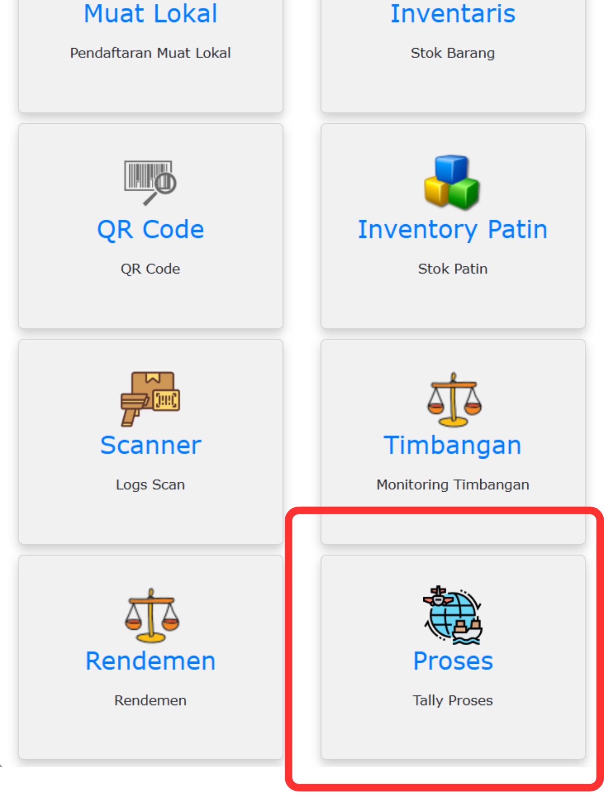
    *Gambar II.II: Tally Proses.*

4.  **Buat Sesi Baru:** Klik tombol **Buat Sesi Baru**.

    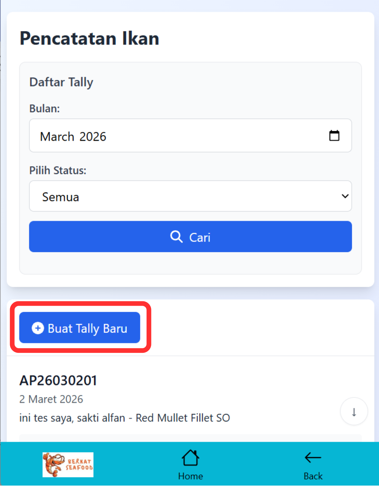
    *Gambar II.III: Buat Sesi Baru.*

5. **Masukan Jenis Ikan:** Isi **Tanggal** dan **Jenis Ikan** yang akan diolah, lalu klik **Simpan.**

    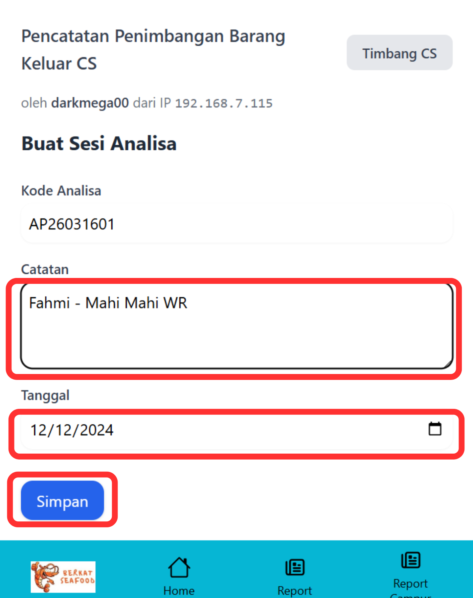
    *Gambar II.IV: Form Pembuatan Sesi Baru.*

> ⚠️ **Peringatan**   **Satu Sesi** hanya untuk **Satu Jenis Ikan!**

---

## III. Registrasi Bahan Baku

&nbsp;&nbsp;&nbsp;&nbsp;&nbsp;Ikuti langkah berikut:

1. **Pilih Sesi:** Cari **Sesi** yang sudah dibuat, klik menu **REG**

    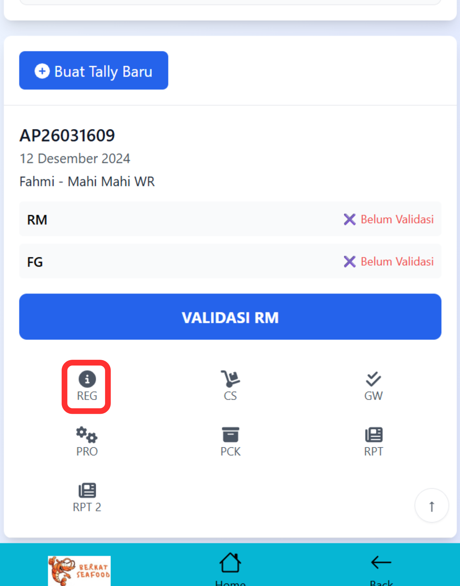
    *Gambar III.I: Pilih Sesi*

2. **Masukan Data:** Isi data berikut:
    - **Sesi Pengiriman:** Pilih **BPB dari website**
    - **Supplier (Non BPB):** Isi manual jika **BPB tidak dari website**
    - **Kode Supplier:** Isi manual jika **BPB tidak dari website**
    
     

    **⚠️ Perhatikan ketentuan dibawah ini!**

    | Kondisi | Yang Dilakukan |
    |--------|--------|
    | BPB dari Website | Pilih **Sesi Pengiriman**|
    | BPB **bukan** dari Website | **Kosongkan** sesi pengiriman, isi suppllier & kode supplier |

     

    - **Jenis Ikan:** Nama ikan yang akan diproses
    - **Tanggal:** Tanggal bahan keluar dari CS
    - **Proses Pengerjaan:** Pilih proses pengerjaan yang sesuai

     

    **⚠️ Perhatikan ketentuan dibawah ini!**

     | Metode | Deskripsi | Kapan Digunakan |
    |--------|--------|--------|
    | Pisah | 1 BPB = 1 Hasil Proses | Untuk BPB yang diproses terpisah|
    | Campur Size | 1 BPB dengan ukuran berbeda | Untuk mencampur size dalam 1 BPB |
    | Campur BPB | Gabungan beberapa BPB | Untuk menggabungkan beberapa BPB jadi 1 proses |

     

    - **Kode Ikan:** Hanya untuk **Reproses**
    - **Catatan:** Untuk **Pengelompokan** data

     

    **⚠️Perhatikan ketentuan dibawah ini!**

    |Aturan|
    |--|
    |✅ Catatan yang sama akan digabung jadi 1 kelompok|
    |✅ Catatan yang berbeda akan dipisah jadi kelompok yang berbeda|
    |❌ Spasi juga akan berpengaruh: "ABC" tidak sama dengan "A BC"|
    |❌ Huruf besar dan kecil juga akan berpengaruh: "abc" tidak sama dengan "ABC"|

     

    |Contoh Penggunaan|
    |-------|

   

    | Catatan | Hasil |
    |-----------------|-------|
    | "SupplierA" / "Supplier A" / "Supplier a" | Jadi **3 Group** yang **Berbeda** |
    | "Supplier A" / "Supplier A" / "Supplier A" | Jadi **1 Group** yang **Sama** |

     

    > 💡**Tips**   Gunakan **Catatan** yang **Konsisten** untuk menghindari kesalahan pengelompokan

     

4. **Mulai Timbang:** Klik **Mulai Timbang** untuk lanjut

    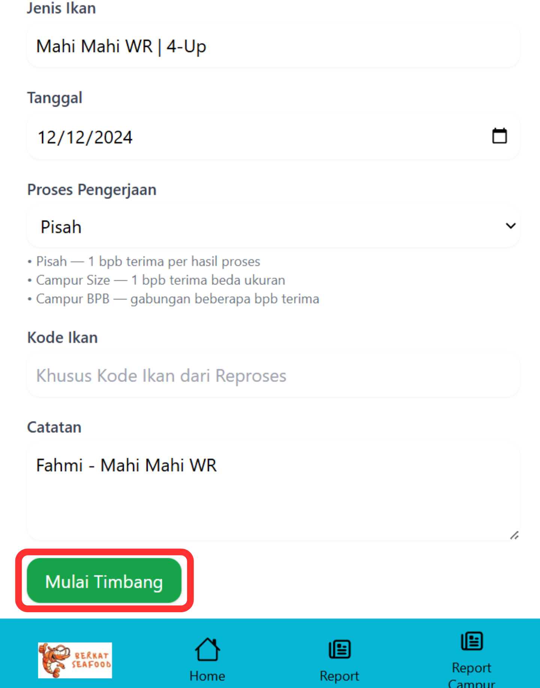
    *Gambar III.II: Mulai Timbang*

---

## IV. Input Timbangan

&nbsp;&nbsp;&nbsp;&nbsp;&nbsp;Ikuti langkah berikut:

1. **Pilih Jenis Ikan:** Setiap jenis ikan akan ditampilkan dalam bentuk **Card** di sistem, pilih ikan untuk mulai melakukan penimbangan

    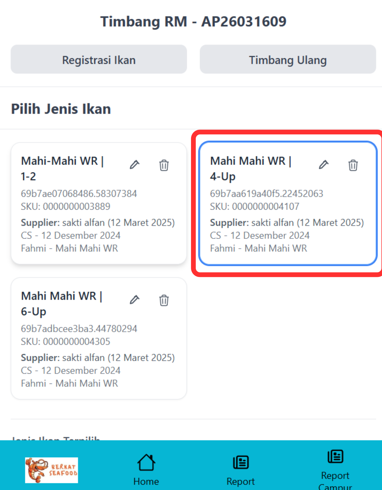
    *Gambar IV.I: Pilih Jenis Ikan*

    > ⚠️ **Penting**   Penimbangan akan dilakukan **Dua Kali!**

     

2. **Timbangan Pertama:** Input berat awal (dari **CS / Penerimaan**)

    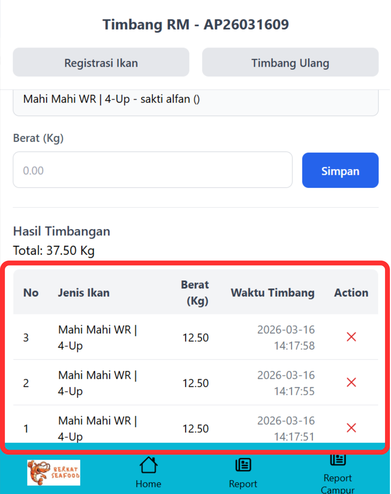
    *Gambar IV.II: Timbangan Pertama*

     

    Setelah selesai, klik **Timbang Ulang** untuk lanjut:

    
    *Gambar IV.III: Timbang Ulang*

3. **Timbangan Kedua:** Untuk **Validasi** dan akan digunakan sebagai **Dasar Perhitungan** selanjutnya

    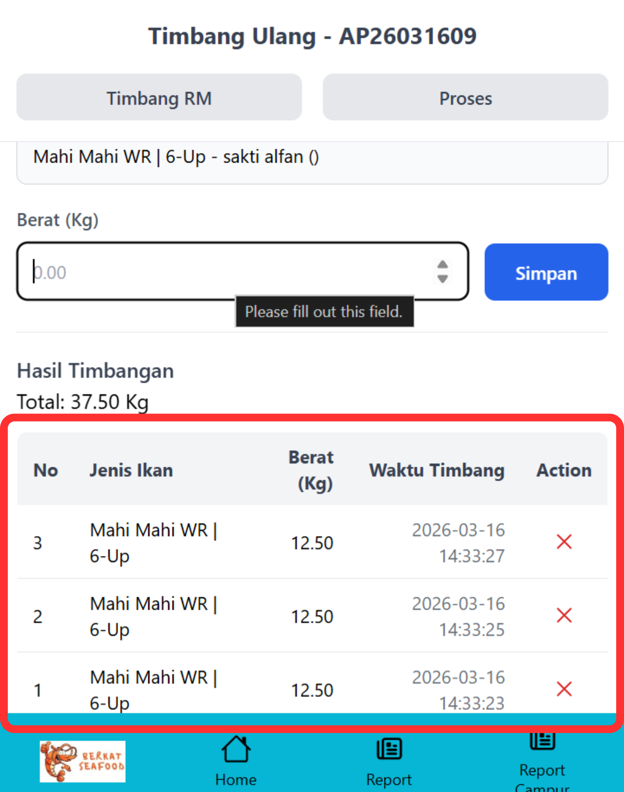
    *Gambar IV.IV: Timbangan Kedua*

    Setelah selesai, klik **Proses** untuk lanjut:

    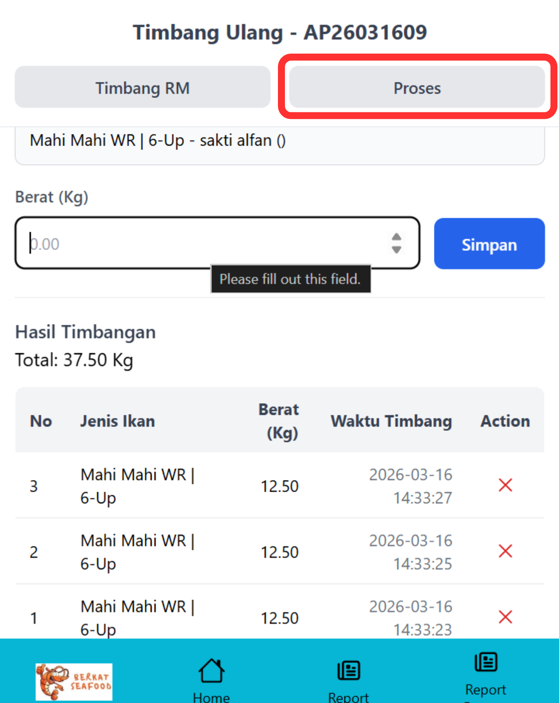
    *Gambar IV.V: Proses*

---

## V. Input Proses

&nbsp;&nbsp;&nbsp;&nbsp;&nbsp;Ikuti langkah berikut:

1. **Siapkan Data:** Isi data berikut:

    - **Asal Ikan:** Sesuaikan dengan **Pengelompokan** saat registrasi
    - **Jenis Proses:** (contoh: Fillet, Whole)
    - **Hasil Proses:** (contoh: 2/4, 4/6)  

    **⚠️ Perhatikan ketentuan dibawah ini!**
    
    |Jika item tidak ada, bisa dibuat manual dengan syarat:|
    |-----|
    |Cek dahulu sebelum membuat yang baru|
    |Item benar-benar belum ada dalam daftar|
    |Jangan buat data yang sama|

    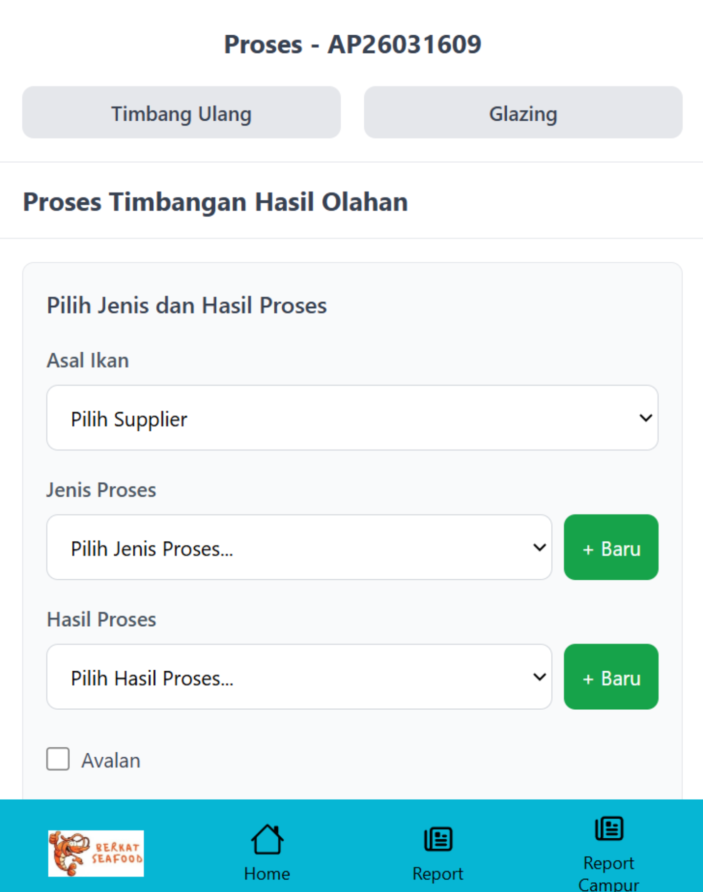
    *Gambar V.I: Siapkan Data*
    
2. **Input Timbangan:** Hasil dari setiap kombinasi akan ditampilkan dalam bentuk card, input hasil timbang per kombinasi per proses.

    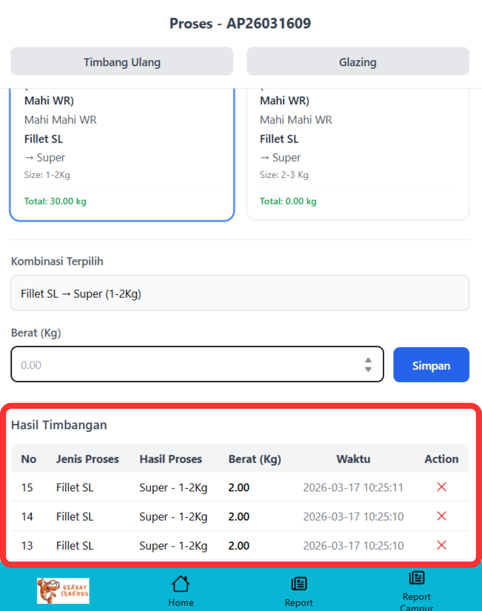
    *Gambar V.II: Input Timbangan

---

## VI. Packing

&nbsp;&nbsp;&nbsp;&nbsp;&nbsp;Tahapan packing terdiri dari **3 Jenis**:

### VI.I Sebelum Glazing

Tahap ini dilakukan sebagai dasar sebelum proses glazing:

1. **Pilih Tahapan:** Pilih tahapan **Sebelum Glazing.**

    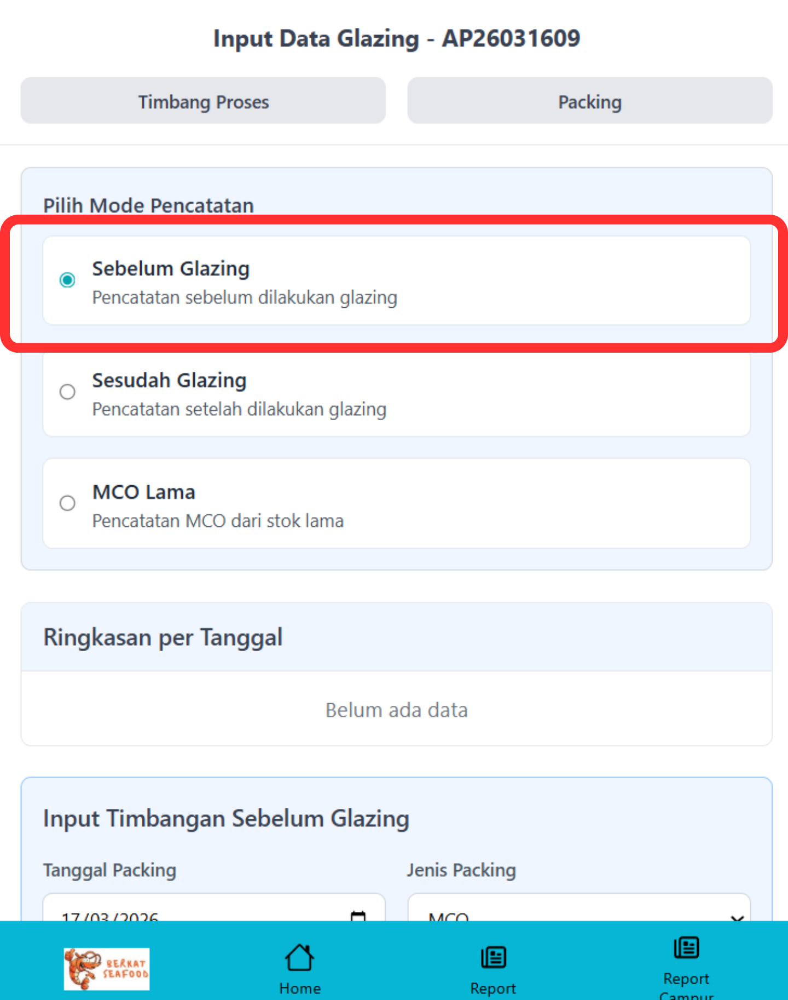
    *Gambar VI.I.I: Pilih Tahapan*

2. **Input Hasil Packing:** Masukan **Hasil Packing**

    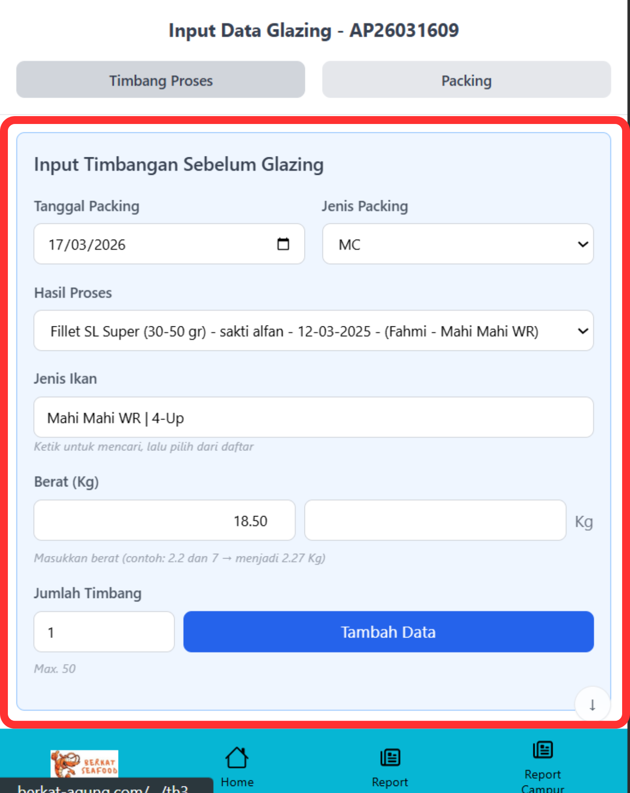
    *Gambar VI.I.II: masukan Hasil Packing*

3. **Masukan Berat Timbangan:** Masukan **Hasil Timbangan**

    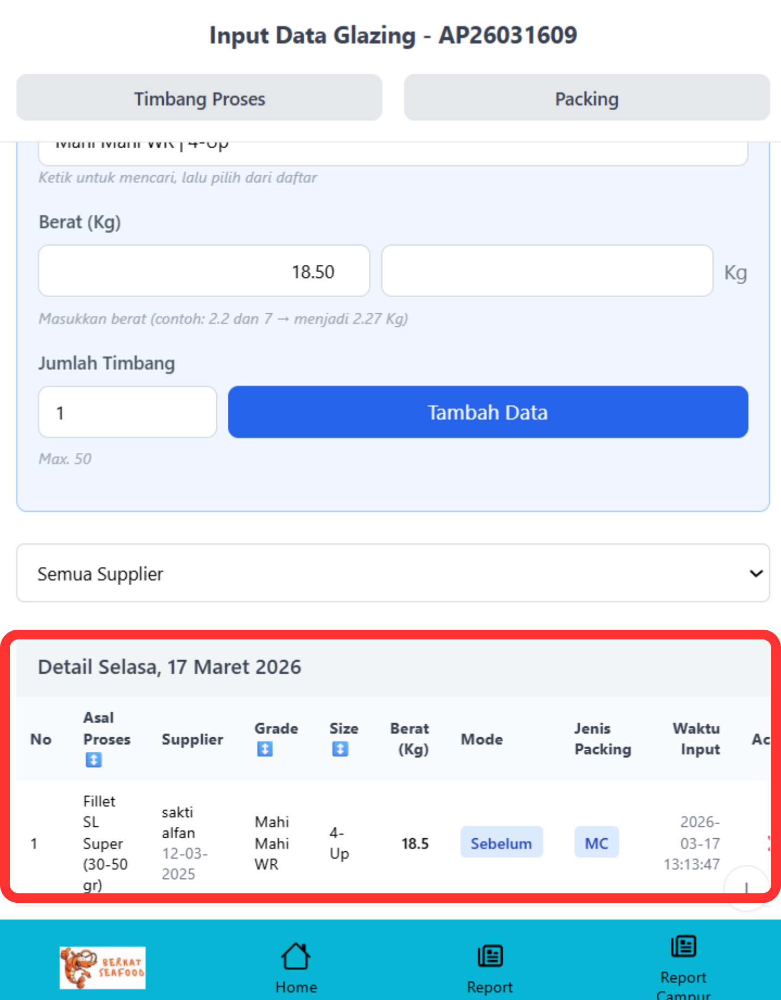
    *Gambar VI.I.II: hasil Inputan*

### VI.II Sesudah Glazing

> ⚠️ **Penting**   Harus siapkan **Master** terlebih dahulu!

Tahapan selanjutnya adalah memasukan data Sesudah Glazing, sebagai berikut:

1. **Pilih Tahapan:** Pilih tahapan **Sesudah Glazing.**

    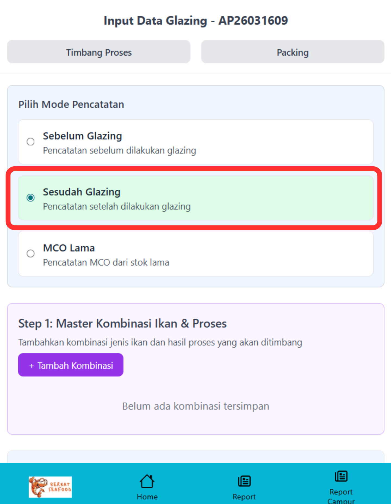
    *Gambar V.II.I: Pilih Tahapan Sesudah Glazing*

2. **Buat Master:** Klik **Tambah Kombinasi**, lalu isi:

    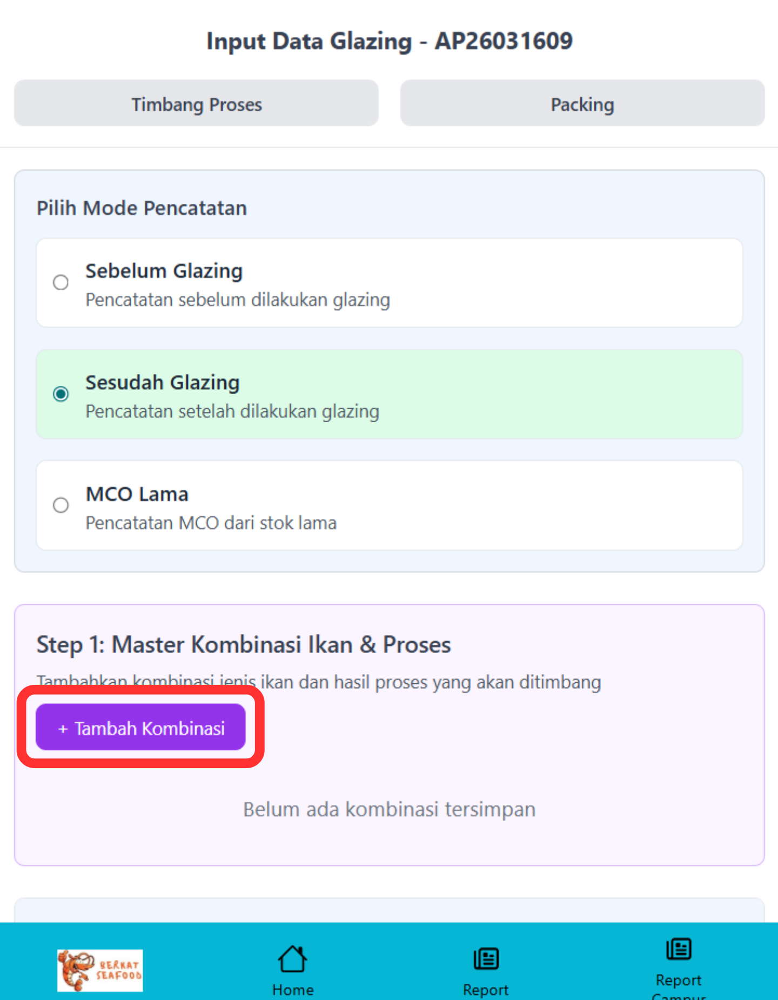
    *Gambar VI.II.II: Tambah Kombinasi*

    - **Hasil Proses:** Asal **Hasil Proses**
    - **Jenis Ikan:**  Jenis Ikan yang di proses
    - **Berat per PV/PB:** Berat standar **1 Pack Vacuum (Kg)**
    - **PV/PB per MC:**  Berapa **PV** dalam **1 Master Cartoon**

     

    **📖 Cara Kerja Sistem:**

    | Kondisi | Hasil |
    |--------|--------|
    | Berat = Berat **1 PV** | Dihitung sebagai **1 PV** |
    | Total PV = **PV per MC** | **Otomatis** jadi **1 MC** |
    | Berat **<** Berat 1 PV| **Otomatis** jadi **MCO Akhir** |

    **📚 Contoh Perhitungan:** 
    
    |Master|
    |---|
    |- Berat **1 PV** = **10 Kg**   - Jumlah **PV per MC** = **5 PV**|

    |Timbangan|Hasil|
    |---|---|
    |Timbangan 1 = 10 Kg|Jadi 1 PV|
    |Timbangan 2 = 10 Kg |Jadi 1 PV **(Total 2 PV)**|
    |Timbangan 3 = 10 Kg|Jadi 1 PV **(Total 3 PV)**|
    |Timbangan 4 = 10 Kg|Jadi 1 PV **(Total 4 PV)**|
    |Timbangan 5 = 10 Kg|Jadi 1 PV **(Total 5 PV)** -> **Otomatis jadi 1 MC**|
    |Timbangan 6 = 7 kg (Berat < 10 Kg)|**Otomatis jadi MCO Akhir**|

    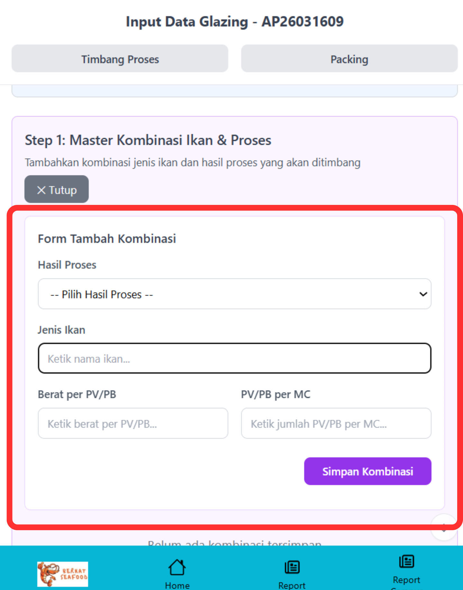
    *Gambar VI.II.III: Masukan Untuk Membuat Master*

    Klik **Simpan Kombinasi** untuk menyimpan **Master**

    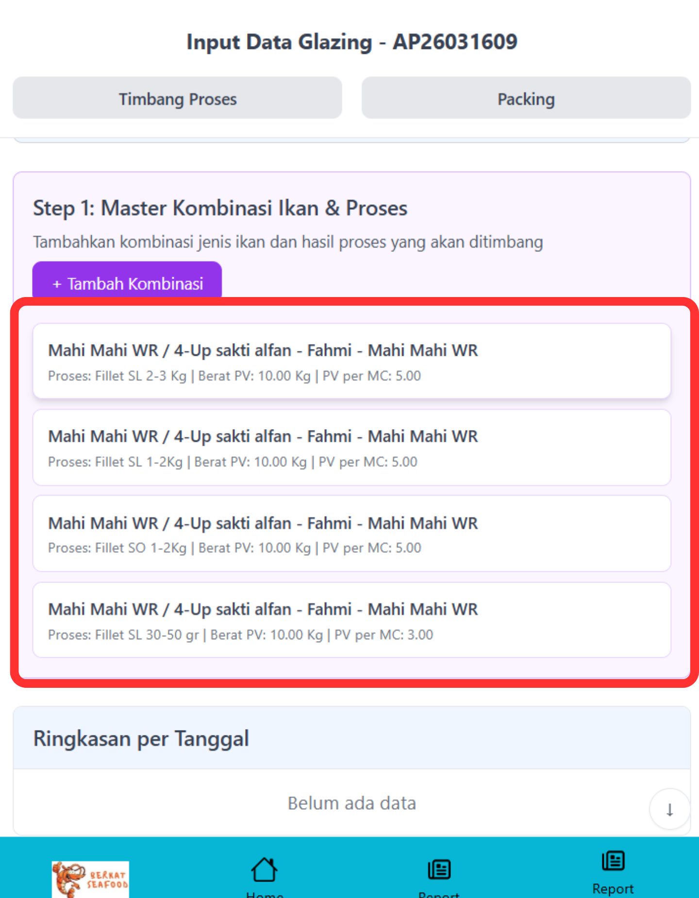  
    *Gambar VI.II.III: Master yang sudah dibuat.*

3. **Masukan Data:** Isi data:

    - **Tanggal Packing:** Tanggal proses packing dilakukan
    - **Jenis Packing:** (MC atau MCO)
    - **Pilih Kombinasi Ikan & Proses:** Pilih master

    Selanjutnya, masukan berat sesuai **Standar PV**

    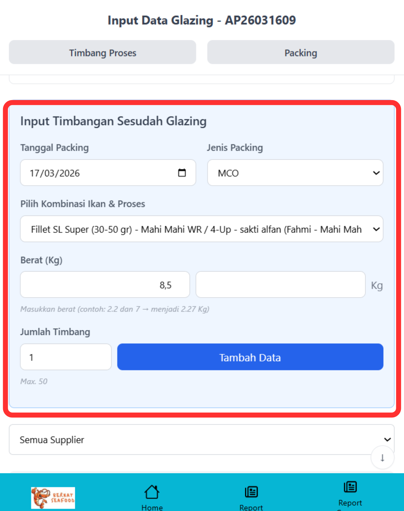
    *Gambar VI.II.V: Masukan Hasil Glazing*

    Hasilnya akan tampil berupa **Tabel**:

    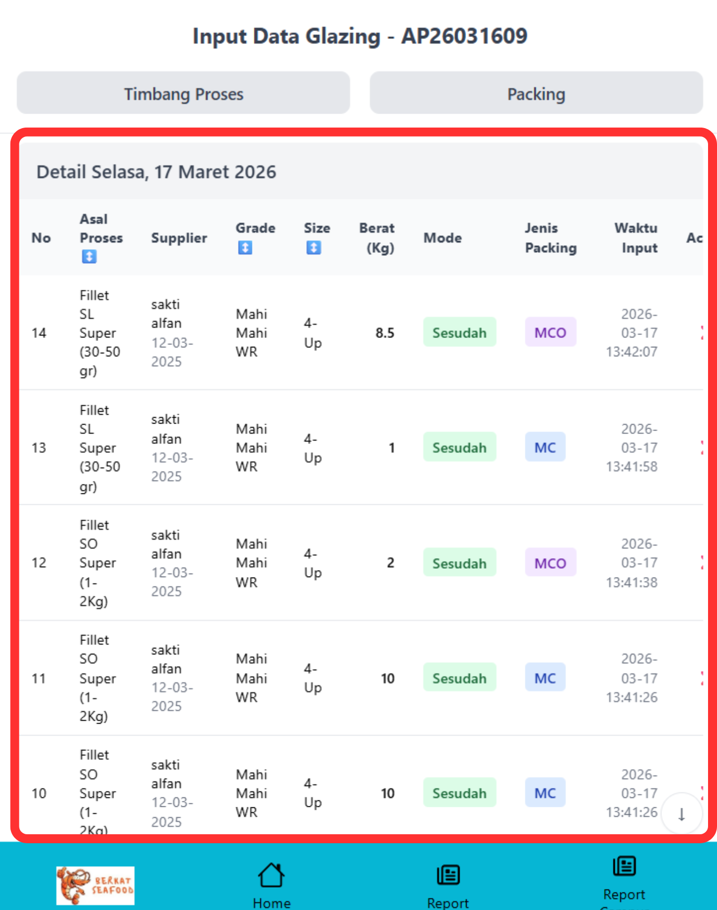
    *Gambar VI.II.VI: Hasil Kiloan*

### VI.III MCO Lama

Jika ada MCO Lama, masukan langsung tanpa melalui perhitungan:

1. **Pilih Tahapan:** Pilih tahapan **MCO Lama**

    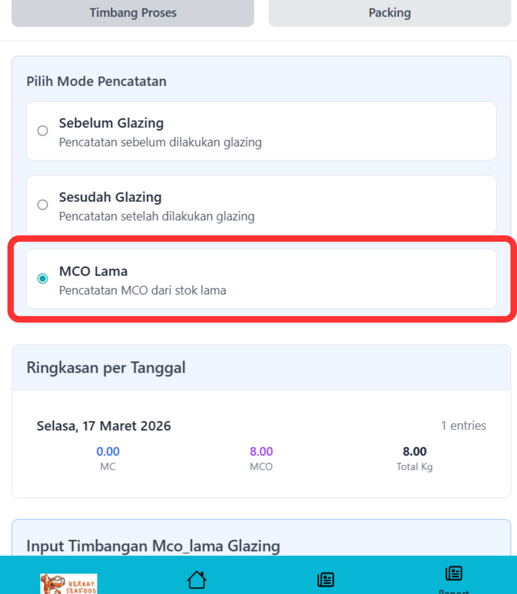
    *Gambar V.III.I: Pilih Tahapan MCO Lama*

2. **Tambah Data:** Masukan data, lalu klik **Tambah Data** untuk memasukan hasil

    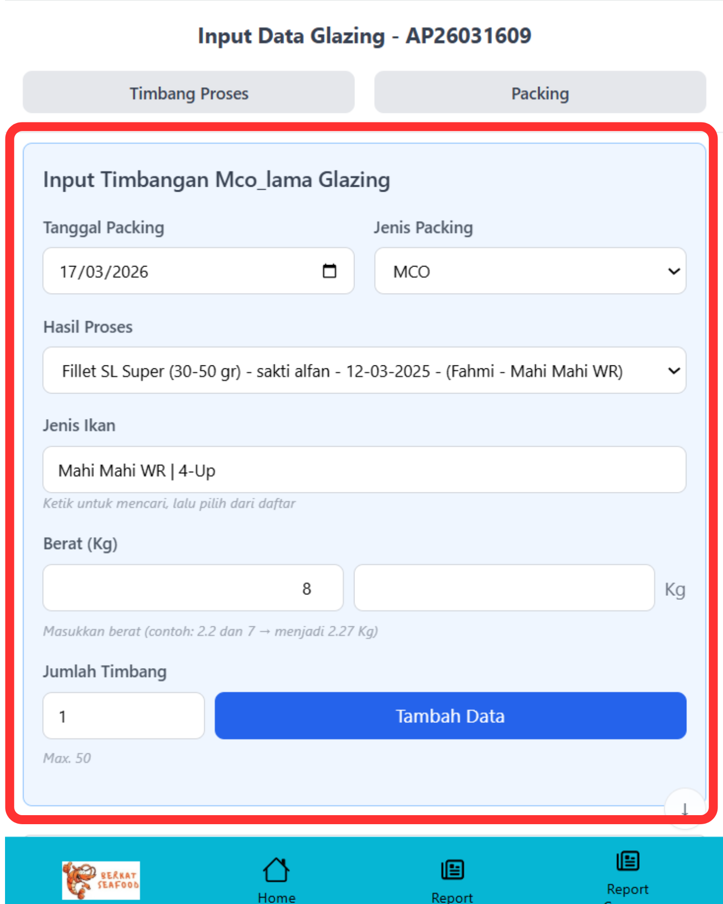
    *Gambar V.III.II: Tambah Data MCO Lama*

