# Bagindo — Flowchart Sistem

Flowchart lengkap cara kerja project Bagindo (Synergis ERP untuk PT Berkat Agung).
Dibuat menggunakan Mermaid diagram — render di GitLab, GitHub, VS Code (Mermaid extension), atau mermaid.live.

---

## 1. Alur Request & Autentikasi

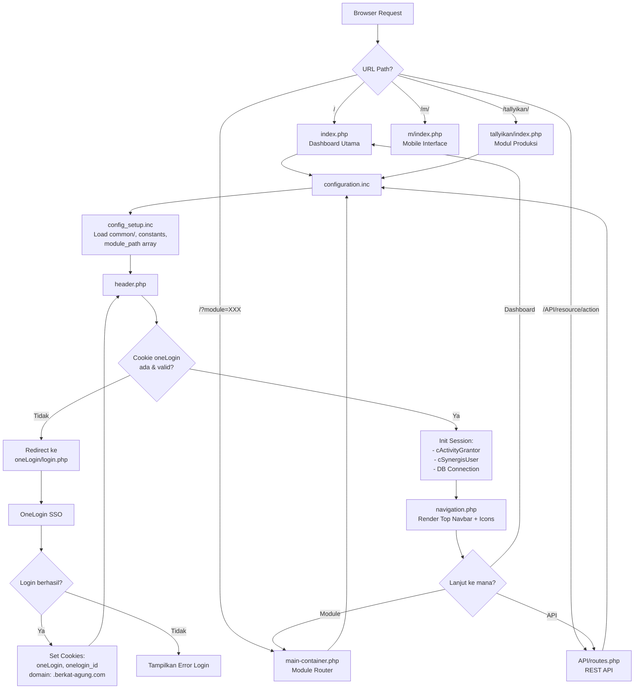

---

## 2. Dashboard Utama & Menu Navigasi

```mermaid
flowchart TD
    DASH[index.php — Dashboard Utama] --> ACL{Cek Permission<br/>per Menu Item}
    
    ACL --> PEOPLE["<b>People</b><br/>people_dashboard<br/>ACL: people/dashboard"]
    ACL --> KONTAK["<b>Kontak</b><br/>addressbook<br/>ACL: addressbook/main"]
    ACL --> PO_MENU["<b>Pesan Ke Supplier</b><br/>(Dropdown PO)<br/>ACL: po/main"]
    ACL --> SALES_MENU["<b>Penjualan</b><br/>(Dropdown Sales)<br/>ACL: sales/main"]
    ACL --> CRM_MENU["<b>CRM</b><br/>(Dropdown)<br/>ACL: crm/main"]
    ACL --> INV_MENU["<b>Inventaris</b><br/>(Dropdown)<br/>ACL: inventory/main_menu"]
    ACL --> TALLY["<b>Tally Ikan</b><br/>tallyikan/<br/>(Hardcoded)"]
    ACL --> PACK_MENU["<b>Packing</b><br/>(Dropdown)<br/>ACL: warehouse/packing"]
    ACL --> AR["<b>Tagihan Penjualan</b><br/>AR_invoice.php<br/>ACL: sales/AR_main"]
    ACL --> AP["<b>Tagihan Pembelian</b><br/>AP.php<br/>ACL: po/AP_main"]
    ACL --> REPORT["<b>Laporan</b><br/>reports.php<br/>ACL: reports/main_menu"]
    ACL --> ACCT["<b>Accounting</b><br/>ACCOUNTING_WEB_HOME<br/>ACL: accounting/main_page"]
    ACL --> DEV["<b>Perangkat</b><br/>devices/<br/>ACL: devices/main"]
    ACL --> HRD["<b>HRD</b><br/>HRD/<br/>ACL: hrd/main"]
    ACL --> ASSET["<b>Manajemen Aset</b><br/>assets/<br/>ACL: assets/main"]
    ACL --> GIS["<b>GIS</b><br/>gis/<br/>ACL: gis/main"]
    ACL --> ADMIN["<b>Administrasi</b><br/>admin/<br/>ACL: system/admin"]
    
    style TALLY fill:#ff9900,stroke:#cc7700,color:#000
```

---

## 3. Submenu Detail per Modul

### 3a. Purchase Order (Pesan Ke Supplier)

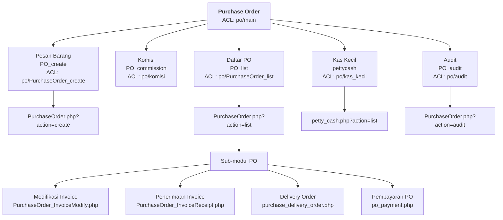

### 3b. Penjualan (Sales)

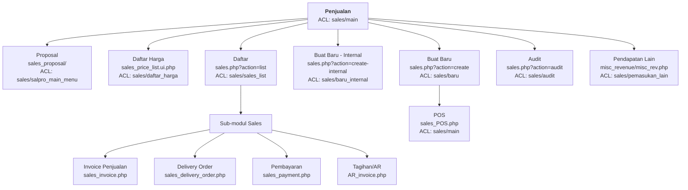

### 3c. CRM

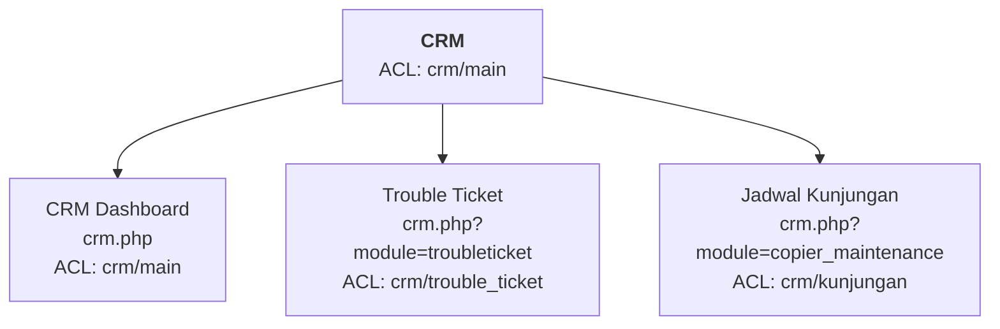

### 3d. Inventaris

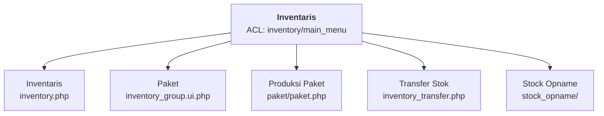

### 3e. Packing & Pengiriman

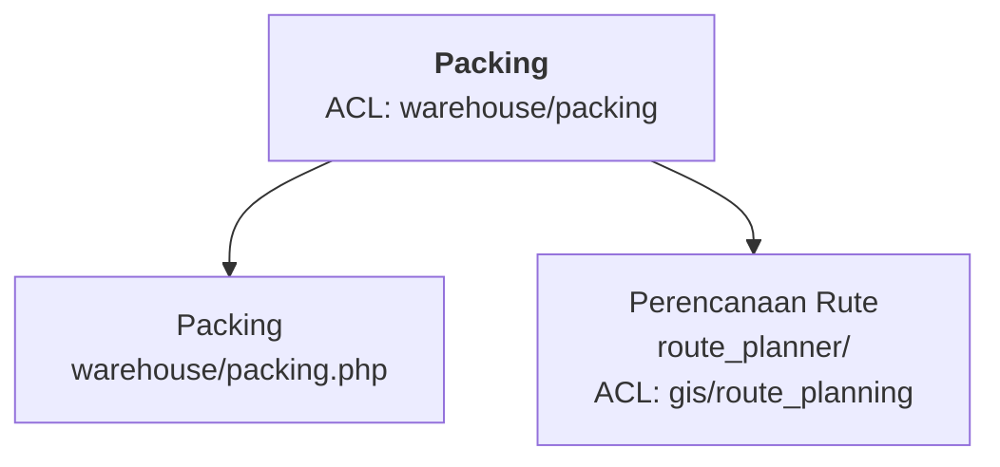

### 3f. Administrasi

```mermaid
flowchart TD
    ADMIN["<b>Admin</b><br/>ACL: system/admin"] --> ADM_BIZ["Administrasi Bisnis"]
    ADMIN --> ADM_FIN["Administrasi Keuangan"]
    ADMIN --> ADM_SYS["Administrasi Sistem"]
    
    ADM_BIZ --> B1["Project Management"]
    ADM_BIZ --> B2["Brand Management"]
    ADM_BIZ --> B3["Category Management"]
    ADM_BIZ --> B4["Unit Management"]
    ADM_BIZ --> B5["Discount Management"]
    ADM_BIZ --> B6["Warehouse Management"]
    ADM_BIZ --> B7["Sales Proposal Stages"]
    ADM_BIZ --> B8["Sales Commission"]
    ADM_BIZ --> B9["File Management"]
    
    ADM_FIN --> F1["Kategori Kas Kecil"]
    ADM_FIN --> F2["Rekening Bank"]
    ADM_FIN --> F3["Cek Bank"]
    ADM_FIN --> F4["Penomoran Faktur"]
    
    ADM_SYS --> S1["SQL Query Interface"]
    ADM_SYS --> S2["Data Migration"]
    ADM_SYS --> S3["User Management"]
    ADM_SYS --> S4["Salesperson Management"]
    ADM_SYS --> S5["ACL Management"]
    ADM_SYS --> S6["Konfigurasi Sistem"]
    ADM_SYS --> S7["Report Templates"]
```

### 3g. Top Navbar Icons

```mermaid
flowchart LR
    NAV[Top Navbar] --> N1["🏠 Home"]
    NAV --> N2["CRM"]
    NAV --> N3["Kontak"]
    NAV --> N4["PO"]
    NAV --> N5["Proposal"]
    NAV --> N6["Sales"]
    NAV --> N7["E-Commerce"]
    NAV --> N8["AR"]
    NAV --> N9["AP"]
    NAV --> N10["Laporan"]
    NAV --> N11["Inventaris"]
    NAV --> N12["Packing"]
    NAV --> N13["Perangkat"]
    NAV --> N14["Admin"]
    NAV --> N15["Manual"]
    NAV --> N16["🔔 Commhub"]
    NAV --> N17["✉️ Messaging"]
    NAV --> N18["⚙️ Settings"]
    NAV --> N19["📁 FileManager"]
    NAV --> N20["👤 Profil"]
    NAV --> N21["🚪 Sign Out"]
```

---

## 4. Alur Bisnis Utama: Procurement → Sales

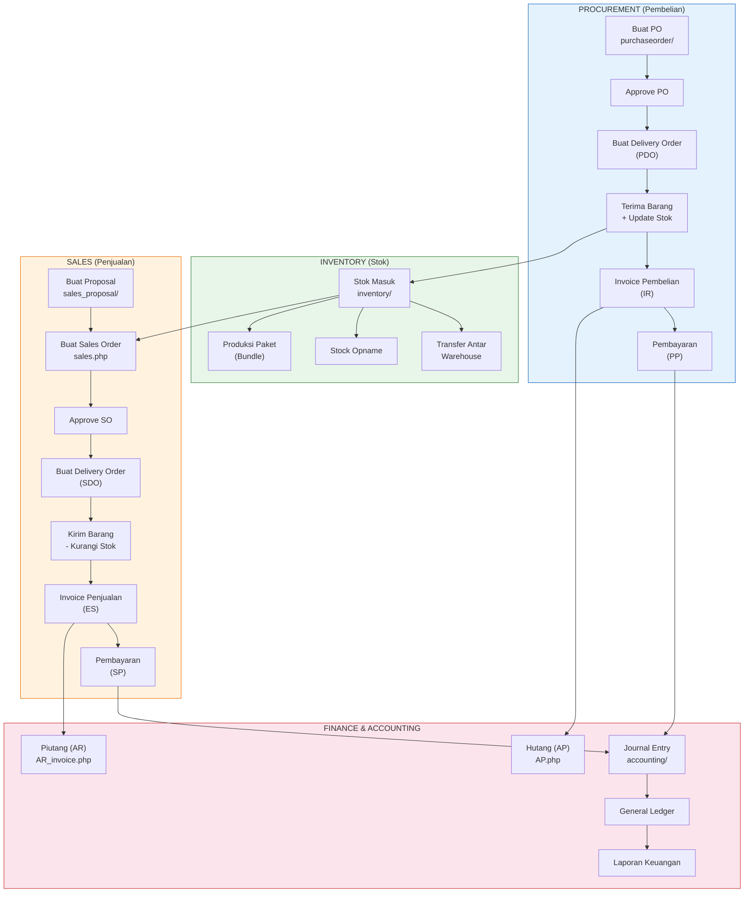

---

## 5. Alur Produksi Tally Ikan (Modul Custom)

```mermaid
flowchart TD
    subgraph REG["1. REGISTRASI"]
        R1["registertally.php<br/>Daftar tally baru"]
        R1 --> R2["Input: supplier, tanggal,<br/>operator, warehouse"]
        R2 --> R3["Generate Tally ID<br/>Format: XXYYMMDDHH<br/>TL=Normal, RP=Repack,<br/>SP=Spesial, LD=Loading"]
    end

    subgraph TH1["2. PENERIMAAN (TH1)"]
        T1["th1.php<br/>Goods Receipt"]
        T1 --> T2["Buat grup penerimaan<br/>per SKU/jenis ikan"]
        T2 --> T3["Timbang per item<br/>→ receiving_records"]
        T3 --> T4["Total berat per grup<br/>→ receiving_records_group"]
    end

    subgraph TH2["3. VERIFIKASI (TH2)"]
        V1["th2.php<br/>Gross Weight Verification"]
        V1 --> V2["Verifikasi total berat<br/>per grup"]
        V2 --> V3["→ receive_verification_records"]
    end

    subgraph TH3["4. PRA-PROSES (TH3)"]
        PP1["th3.php<br/>Pre-Processing"]
        PP1 --> PP2["Sortir & Grading:<br/>Normal, Memar, Yellow, Reject"]
        PP2 --> PP3["Tipe: BL (Belly),<br/>NBL (Non-Belly)"]
        PP3 --> PP4["→ preprocess_records"]
    end

    subgraph PROSES["5. PROSES (15 Jenis)"]
        PR1["pre-th3.php<br/>Penugasan & Eksekusi"]
        PR1 --> PR2["Assign pekerja ke keloter<br/>→ process_executors"]
        PR2 --> PR3["15 jenis proses:<br/>Fillet, Skinless, Trim,<br/>Premium Checker, NBL Checker,<br/>Head/Bone, Tail, Belly,<br/>Skin, Dark Flesh, Debris,<br/>Side, Yellow, Bruising, Broken"]
        PR3 --> PR4["Catat hasil per proses<br/>→ process_result_records"]
    end

    subgraph SOAK["6. SOAKING"]
        SK1["soaking.php<br/>Perendaman/Curing"]
        SK1 --> SK2["Input: berat sebelum,<br/>berat sesudah, mesin"]
        SK2 --> SK3["→ soaking_result_records<br/>→ soaking_machine_records"]
    end

    subgraph FREEZE["7. FREEZING"]
        FR1["freezing.php<br/>Pembekuan"]
        FR1 --> FR2["Catat penyusutan berat<br/>sebelum vs sesudah beku"]
        FR2 --> FR3["→ freezing_result_records"]
    end

    subgraph GLAZE["8. GLAZING (4 tahap: A-D)"]
        GL1["glazing.php<br/>Pelapisan Es"]
        GL1 --> GL2["4 sub-tahap glazing<br/>(A, B, C, D)"]
        GL2 --> GL3["Assign barcode<br/>per item produk"]
        GL3 --> GL4["→ glazing_result_records<br/>→ barcode"]
    end

    subgraph PACK["9. PACKING"]
        PK1["packing.php<br/>Pengemasan"]
        PK1 --> PK2["Scan barcode<br/>(validasi: ada, belum dipakai,<br/>qty glazing >= qty packing)"]
        PK2 --> PK3["MC = Master Carton<br/>MCO = Excess"]
        PK3 --> PK4["→ packing_result_records"]
    end

    subgraph LOAD["10. LOADING"]
        LD1["muat-lokal.php<br/>Pengiriman"]
        LD1 --> LD2["Scan barcode carton"]
        LD2 --> LD3["Buat dokumen muat<br/>& BPB"]
        LD3 --> LD4["Selesai — Barang Terkirim"]
    end

    REG --> TH1
    TH1 --> TH2
    TH2 --> TH3
    TH3 --> PROSES
    PROSES --> SOAK
    SOAK --> FREEZE
    FREEZE --> GLAZE
    GLAZE --> PACK
    PACK --> LOAD

    style REG fill:#e8eaf6,stroke:#3f51b5
    style TH1 fill:#e3f2fd,stroke:#1976d2
    style TH2 fill:#e1f5fe,stroke:#0288d1
    style TH3 fill:#e0f7fa,stroke:#00838f
    style PROSES fill:#e0f2f1,stroke:#00695c
    style SOAK fill:#e8f5e9,stroke:#2e7d32
    style FREEZE fill:#f1f8e9,stroke:#558b2f
    style GLAZE fill:#fffde7,stroke:#f9a825
    style PACK fill:#fff3e0,stroke:#ef6c00
    style LOAD fill:#fbe9e7,stroke:#d84315
```

---

## 6. Barcode Lifecycle (dalam Tallyikan)

```mermaid
flowchart LR
    REQ["Request Barcode<br/>barcode_id_request"] --> GEN["Generate<br/>Barcode ID"]
    GEN --> PRINT["Print QR Code"]
    PRINT --> ASSIGN["Assign di Glazing<br/>glazing_result_records"]
    ASSIGN --> SCAN_PACK["Scan di Packing<br/>AJAX_scan.php"]
    SCAN_PACK --> VALID{Validasi}
    VALID -->|Barcode ada| CHECK{Sudah dipakai?}
    VALID -->|Tidak ada| ERR1["❌ Barcode tidak ditemukan"]
    CHECK -->|Belum| QTY{qty glazing >= qty packing?}
    CHECK -->|Sudah| ERR2["❌ Barcode sudah dipakai"]
    QTY -->|Ya| OK["✅ Packing berhasil<br/>packing_result_records"]
    QTY -->|Tidak| ERR3["❌ Qty tidak cukup"]
    OK --> SCAN_MUAT["Scan di Loading<br/>AJAX_scan_muat.php"]
    SCAN_MUAT --> SHIP["Barang dimuat & dikirim"]
```

---

## 7. Alur Data Antar Database

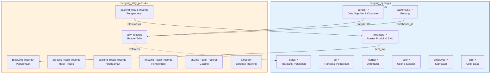

---

## 8. Alur HRD & Kehadiran

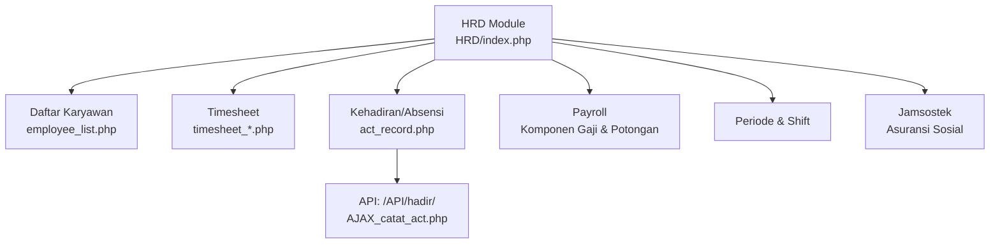

---

## 9. Integrasi Layanan Eksternal

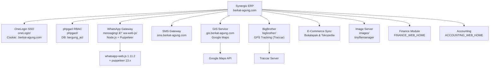

---

## 10. Alur Environment: Dev → Staging → Live

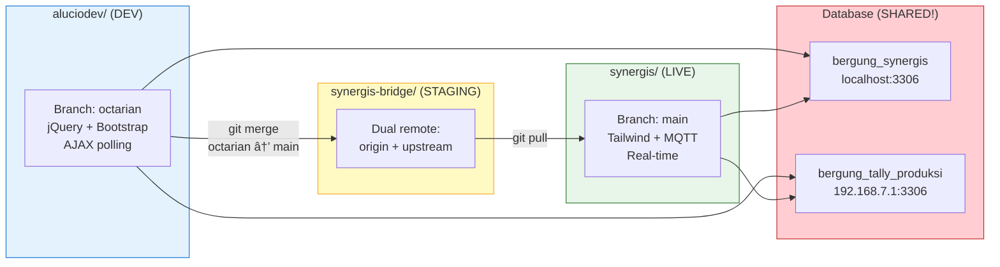

---

## 11. REST API Endpoints

```mermaid
flowchart TD
    API["API/routes.php<br/>POST /API/resource/action"] --> AUTH_API["GET /API/auth/<br/>→ AJAX_configs.php"]
    API --> USER_API["POST /API/user<br/>→ AJAX_user.php"]
    API --> ACL_API["POST /API/acl<br/>→ AJAX_user.php"]
    API --> UI_API["POST /API/UI/<br/>→ AJAX_UI.php"]
    API --> KONTAK_API["POST /API/kontak/<br/>→ AJAX_kontak.php"]
    API --> INV_API["POST /API/inventory/<br/>→ AJAX_inventory.php"]
    API --> SALES_API["POST /API/sales/<br/>→ sales/AJAX_sales.php"]
    API --> SALPRO_API["POST /API/salpro/<br/>→ AJAX_salpro.php"]
    API --> CAT_API["POST /API/category/<br/>→ AJAX_category.php"]
    API --> UNIT_API["POST /API/units/<br/>→ AJAX_units.php"]
    API --> WH_API["POST /API/warehouse/<br/>→ AJAX_warehouse.php"]
    API --> GIS_API["POST /API/gis/<br/>→ AJAX_gis.php"]
    API --> HADIR_API["POST /API/hadir/<br/>→ AJAX_catat_act.php"]
    API --> TT_API["POST /API/troubleticket/<br/>→ AJAX_trouble_ticket.php"]
    
    subgraph TALLY_API["Tallyikan AJAX (Langsung, bukan via routes.php)"]
        AJAX_T["AJAX_timbang.php<br/>create_tally, create_recv_grp,<br/>save_recv_grp, add_recv_record,<br/>add_prepro_weight,<br/>update_*_result_status"]
        AJAX_S["AJAX_scan.php<br/>scan_packing"]
        AJAX_SM["AJAX_scan_muat.php<br/>scan barcode muat"]
        AJAX_V["AJAX_validation.php<br/>validasi tally"]
        AJAX_VM["AJAX_validation_muat.php<br/>validasi muat"]
    end
```

---

## 12. Laporan Tallyikan

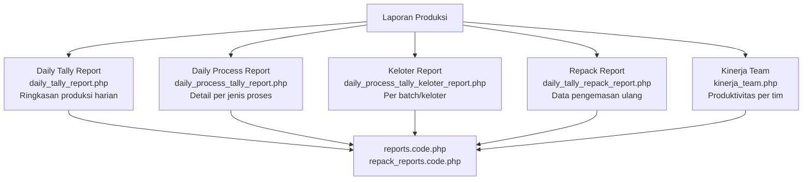

---

## 13. Ringkasan Alur End-to-End: Dari Ikan Masuk Sampai Terkirim

```mermaid
flowchart TD
    START(("Mulai")) --> SUPPLIER["Ikan tuna datang<br/>dari Supplier"]
    SUPPLIER --> REG_TALLY["1. Registrasi Tally<br/>(TL/RP/SP/LD)"]
    REG_TALLY --> TERIMA["2. Penerimaan & Timbang (TH1)<br/>Catat per SKU, per grup"]
    TERIMA --> VERIF["3. Verifikasi Gross Weight (TH2)"]
    VERIF --> SORTIR["4. Pra-Proses (TH3)<br/>Sortir: Normal/Memar/Yellow/Reject<br/>Tipe: Belly/Non-Belly"]
    SORTIR --> PROSES["5. Proses Produksi<br/>15 jenis: Fillet, Skinless, Trim,<br/>Checker, Head/Bone, Tail, dll.<br/>Per keloter (batch pekerja)"]
    PROSES --> RENDAM["6. Soaking/Perendaman<br/>Curing per mesin"]
    RENDAM --> BEKU["7. Freezing/Pembekuan<br/>Catat penyusutan berat"]
    BEKU --> GLAZE["8. Glazing (4 tahap A-D)<br/>Lapisan es + assign barcode"]
    GLAZE --> KEMAS["9. Packing<br/>Scan barcode → MC/MCO<br/>Validasi: barcode valid & qty cukup"]
    KEMAS --> MUAT["10. Loading/Pengiriman<br/>Scan carton → Dokumen BPB"]
    MUAT --> KIRIM["Barang terkirim<br/>ke Customer/Eksportir"]
    KIRIM --> DONE(("Selesai"))
    
    %% Parallel: data masuk ke Synergis
    KEMAS -.->|"Update stok"| INV_SYNC["Inventory Synergis<br/>bergung_synergis"]
    MUAT -.->|"Link ke SO"| SALES_SYNC["Sales Order<br/>→ Invoice → Payment"]
    
    style START fill:#4caf50,stroke:#2e7d32,color:#fff
    style DONE fill:#4caf50,stroke:#2e7d32,color:#fff
    style REG_TALLY fill:#e8eaf6,stroke:#3f51b5
    style TERIMA fill:#e3f2fd,stroke:#1976d2
    style VERIF fill:#e1f5fe,stroke:#0288d1
    style SORTIR fill:#e0f7fa,stroke:#00838f
    style PROSES fill:#e0f2f1,stroke:#00695c
    style RENDAM fill:#e8f5e9,stroke:#2e7d32
    style BEKU fill:#f1f8e9,stroke:#558b2f
    style GLAZE fill:#fffde7,stroke:#f9a825
    style KEMAS fill:#fff3e0,stroke:#ef6c00
    style MUAT fill:#fbe9e7,stroke:#d84315
    style KIRIM fill:#ffccbc,stroke:#bf360c
```

---

*File ini berisi 13 diagram Mermaid yang mencakup seluruh alur kerja Bagindo.*
*Render menggunakan: GitLab Markdown, VS Code (Mermaid Preview), atau https://mermaid.live*
*Terakhir diperbarui: 2 April 2026*
